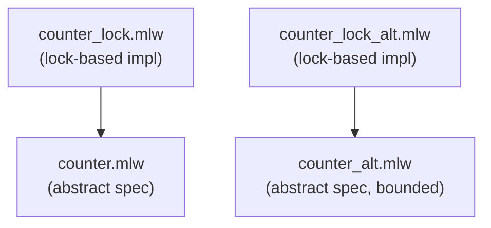

# Concurrent Counter

Refinement of a concurrent (shared memory) counter using a lock, from
an abstract specification that assumes atomic updates.

This example is a WhyML adaptation of a TLA+ example available online
in a [blog post](https://www.hillelwayne.com/post/refinement/) by
Hillel Wayne.

## Files

- [counter.mlw](counter.mlw): abstract specification of a concurrent
  counter, can be seen as an implementation assuming that updates are
  atomic
- [counter_lock.mlw](counter_lock.mlw): implementation using a lock to
  control access to a shared variable, proved by refinement from the
  abstract spec
- [counter_alt.mlw](counter_alt.mlw): alternative version of
  [counter.mlw](counter.mlw). Identifying threads with numbers allows
  a functional property about the value of the counter to be proved
- [counter_lock_alt.mlw](counter_lock_alt.mlw): alt version of
  [counter_lock.mlw](counter_lock.mlw); the property about the value of
  the counter is obtained directly by refinement of the abstract spec

## Refinement Hierarchy

