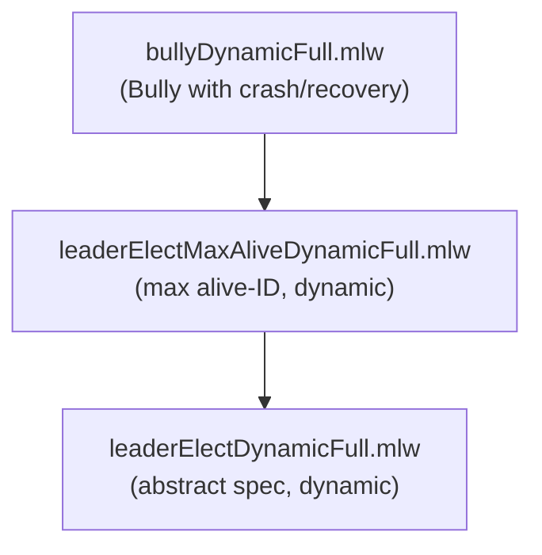

# Dynamic Bully Leader Election

Formalization, by multi-step refinement, of a dynamic Bully leader
election algorithm with crash and recovery of nodes.

## Files

- [leaderElectDynamicFull.mlw](leaderElectDynamicFull.mlw): abstract
  specification of dynamic leader election
- [leaderElectMaxAliveDynamicFull.mlw](leaderElectMaxAliveDynamicFull.mlw):
  specification based on maximum alive node ID in a dynamic setting.
  Refines leaderElectDynamicFull
- [bullyDynamicFull.mlw](bullyDynamicFull.mlw): concrete Bully algorithm
  with crash/recovery and message passing. Refines
  leaderElectMaxAliveDynamicFull

All files: *(Contribution by: Joao Goncalves, Carlos Pina. Adapted to
the why3do refinement framework.)*

## Refinement Hierarchy

