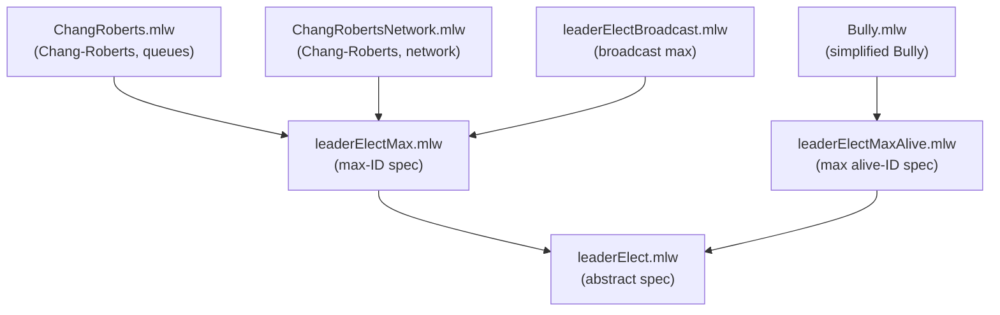

# Leader Election

Formalization, by multi-step refinement, of leader election algorithms
on ring topologies.

## Files

- [leaderElect.mlw](leaderElect.mlw): abstract specification of the
  leader election problem (at most one leader)
- [leaderElectMax.mlw](leaderElectMax.mlw): specification based on node
  IDs and maximum finding. Refines leaderElect
- [leaderElectMaxAlive.mlw](leaderElectMaxAlive.mlw): specification
  based on maximum alive node ID. Refines leaderElect
  *(Contribution by: Joao Goncalves, Carlos Pina. Adapted to the why3do
  refinement framework.)*
- [Bully.mlw](Bully.mlw): simplified Bully algorithm. Refines
  leaderElectMaxAlive
  *(Contribution by: Joao Goncalves, Carlos Pina. Adapted to the why3do
  refinement framework.)*
- [ChangRoberts.mlw](ChangRoberts.mlw): Chang-Roberts algorithm for
  leader election -- unidirectional ring topology, message delivery
  with individual message queues. Refines leaderElectMax
- [ChangRobertsNetwork.mlw](ChangRobertsNetwork.mlw): Chang-Roberts
  algorithm -- unidirectional ring topology, message delivery with
  centralized packet list. Refines leaderElectMax
- [leaderElectBroadcast.mlw](leaderElectBroadcast.mlw): broadcast
  variant of max-based leader election. Refines leaderElectMax

## Refinement Hierarchy

