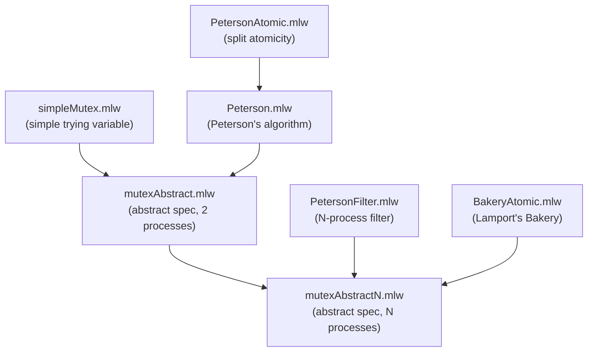

# Mutual Exclusion (Concurrent)

Formalization, by specification refinement, of concurrent mutual
exclusion algorithms.

## Files

- [mutexAbstractN.mlw](mutexAbstractN.mlw): abstract specification of
  N-process mutual exclusion
- [mutexAbstract.mlw](mutexAbstract.mlw): abstract specification of
  two-process mutual exclusion. Refines mutexAbstractN
- [simpleMutex.mlw](simpleMutex.mlw): simple algorithm using just a
  "trying" variable for each process (may deadlock). Refines
  mutexAbstract
- [Peterson.mlw](Peterson.mlw): Peterson's algorithm. Refines
  mutexAbstract
- [PetersonAtomic.mlw](PetersonAtomic.mlw): a variant of Peterson's
  algorithm with split atomicity. Refines Peterson
- [PetersonFilter.mlw](PetersonFilter.mlw): N-process Peterson filter
  algorithm. Refines mutexAbstractN
  *(Contribution by: Miguel Carvalho, Margarida Pires. Adapted to the
  why3do refinement framework.)*
- [BakeryAtomic.mlw](BakeryAtomic.mlw): simplified version of Lamport's
  Bakery algorithm. Refines mutexAbstractN

## Refinement Hierarchy

