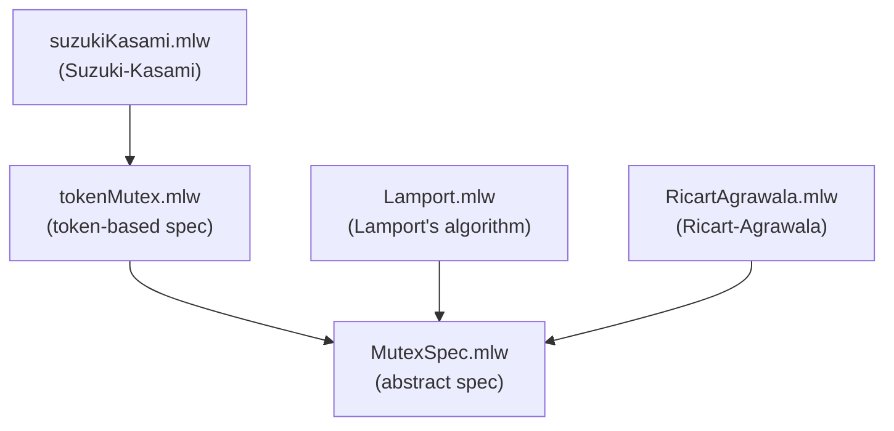

# Mutual Exclusion (Distributed)

Formalization, by specification refinement, of distributed mutual
exclusion algorithms using message passing.

## Files

- [MutexSpec.mlw](MutexSpec.mlw): abstract specification of mutual
  exclusion (critical section occupancy invariant)
- [tokenMutex.mlw](tokenMutex.mlw): intermediate specification based on
  a unique token. Refines MutexSpec
- [Lamport.mlw](Lamport.mlw): Lamport's distributed mutex algorithm
  using logical clocks and request queues. Refines MutexSpec
  *(Original model by: Joao Duarte, Luis Silva. Adapted to the why3do
  refinement framework, with corrections to the clock update and reply
  guard.)*
- [RicartAgrawala.mlw](RicartAgrawala.mlw): Ricart-Agrawala distributed
  mutex algorithm. Refines MutexSpec
  *(Original model by: Claudia Pinto, Patricia Carvalho. Adapted to the
  why3do refinement framework.)*
- [suzukiKasami.mlw](suzukiKasami.mlw): Suzuki-Kasami distributed mutex
  algorithm using a token with a queue. Refines TokenMutex

## Refinement Hierarchy

