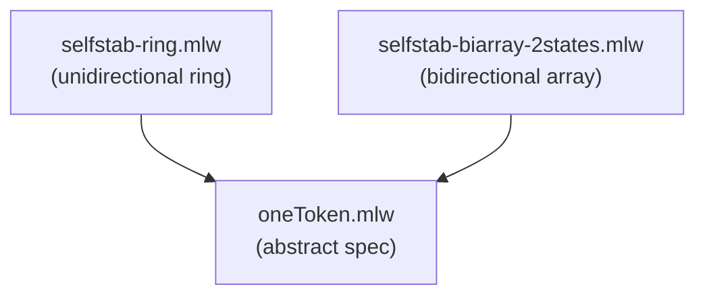

# Mutual Exclusion by Token-passing

Formalization, by specification refinement, of token-based mutual
exclusion algorithms. Specifically, the closure property of Dijkstra's
self-stabilizing systems.

## Files

- [oneToken.mlw](oneToken.mlw): abstract specification of single-token
  systems
- [selfstab-ring.mlw](selfstab-ring.mlw): Dijkstra's unidirectional
  ring system (stable phase, closure property). Refines oneToken
- [selfstab-biarray-2states.mlw](selfstab-biarray-2states.mlw):
  Dijkstra's bidirectional array system (stable phase, closure
  property). Refines oneToken

## Refinement Hierarchy

