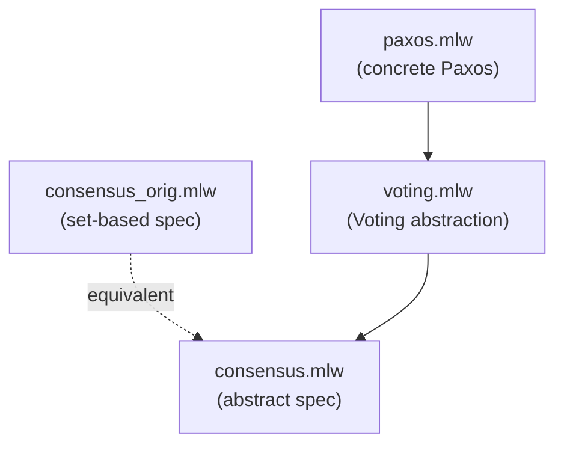

# Paxos Consensus

Proof of correctness of the Paxos consensus protocol by refinement,
following Lamport's TLA+ development
([Consensus.tla](https://github.com/tlaplus/Examples/blob/master/specifications/PaxosHowToWinATuringAward/Consensus.tla)).

It is a two-step development, with the Voting algorithm standing
between the Consensus abstract spec and the Paxos concrete algorithm.

## Files

- [consensus.mlw](consensus.mlw): abstract specification of the
  consensus problem
- [voting.mlw](voting.mlw): intermediate Voting abstraction. Refines
  consensus
- [paxos.mlw](paxos.mlw): concrete Paxos algorithm. Refines voting
- [consensus_orig.mlw](consensus_orig.mlw): original set-based
  formulation of Consensus, shown to be equivalent to
  [consensus.mlw](consensus.mlw) (mutual refinement in both directions)

## Refinement Hierarchy

## Notes

1. Voting and Paxos are formalized in a single module each, including
   the refinement proof. An alternative would be to split each
   development in two modules, one dedicated to the refinement proof.
2. Voting does not export Consensus, which it imports, since many
   names are shared between the two modules. Paxos therefore uses the
   `Consensus.` prefix to refer to names in that module.
3. The module in `consensus_orig.mlw` contains the original set-based
   formulation, with a proof that `consensus.mlw` is a refinement of it
   (and vice versa).
