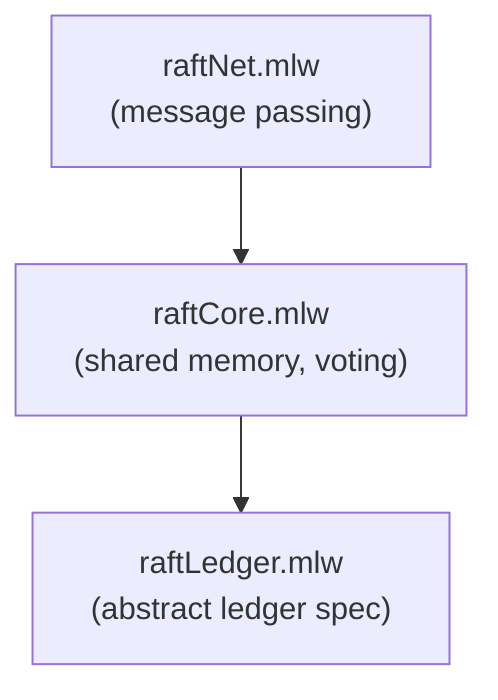

# Raft Leader Election

Formalization, by a three-step refinement chain, of the Raft leader
election protocol. The model progresses from an abstract ledger of
terms, through a shared-memory version with voting and quorums, to a
concrete message-passing implementation.

## Files

- [raftLedger.mlw](raftLedger.mlw): abstract specification -- a ledger
  of terms with a single leader per term
- [raftCore.mlw](raftCore.mlw): intermediate specification with shared
  memory, voting, and quorum reasoning. Refines raftLedger
- [raftNet.mlw](raftNet.mlw): concrete implementation with message
  passing over a network. Refines raftCore

All files: *(Contribution by: Ana Sa Oliveira, Edgar Araujo, Gabriel
Paiva. Adapted to the why3do refinement framework.)*

## Refinement Hierarchy

