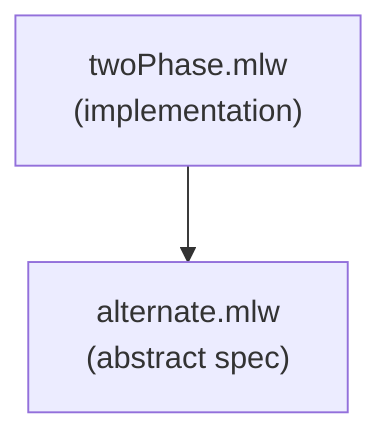

# Two-phase Handshake

Formalization of a hardware protocol where two processes alternately
perform actions, refined from an abstract specification.

This example is a WhyML adaptation of a [TLA+
example](https://github.com/tlaplus/Examples/blob/master/specifications/TwoPhase).

## Files

- [alternate.mlw](alternate.mlw): abstract specification
- [twoPhase.mlw](twoPhase.mlw): implementation

## Refinement Hierarchy

