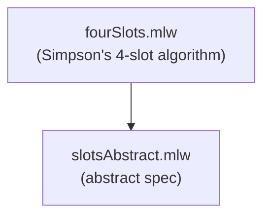

# Wait-free Shared Register

Formalization, by specification refinement, of Simpson's algorithm.
It implements a shared register in a wait-free (and datarace-free) way,
using 4 non-atomic registers. Proof of datarace freedom.

## Files

- [slotsAbstract.mlw](slotsAbstract.mlw): abstract specification of
  data race-free access to a set of slots
- [fourSlots.mlw](fourSlots.mlw): Simpson's algorithm: uses 4 slots and
  4 control (atomic) registers to implement a single shared register
  in a wait-free way. Refines slotsAbstract

## Refinement Hierarchy

